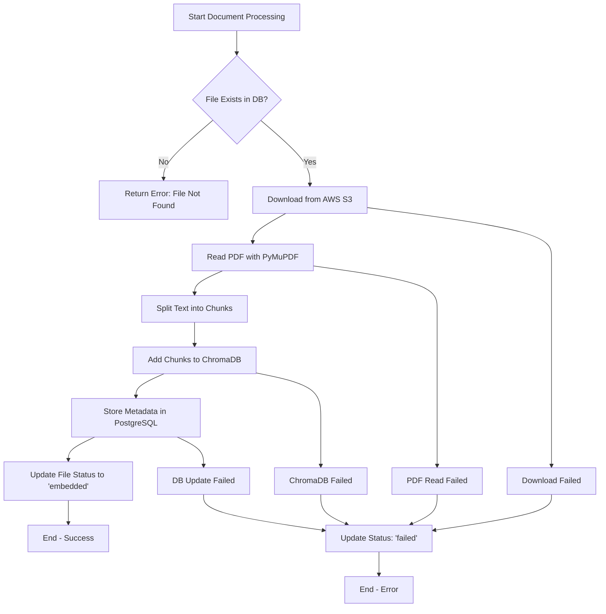

## Document Processing Flow

```mermaid
graph TD
    A[Start Document Processing] --> B{File Exists in DB?}
    B -->|No| C[Return Error: File Not Found]
    B -->|Yes| D[Download from AWS S3]
    D --> E[Read PDF with PyMuPDF]
    E --> F[Split Text into Chunks]
    F --> G[Add Chunks to ChromaDB]
    G --> H[Store Metadata in PostgreSQL]
    H --> I[Update File Status to 'embedded']
    I --> J[End - Success]
    
    D --> K[Download Failed]
    E --> L[PDF Read Failed]
    G --> M[ChromaDB Failed]
    H --> N[DB Update Failed]
    
    K --> O[Update Status: 'failed']
    L --> O
    M --> O
    N --> O
    O --> P[End - Error]
```